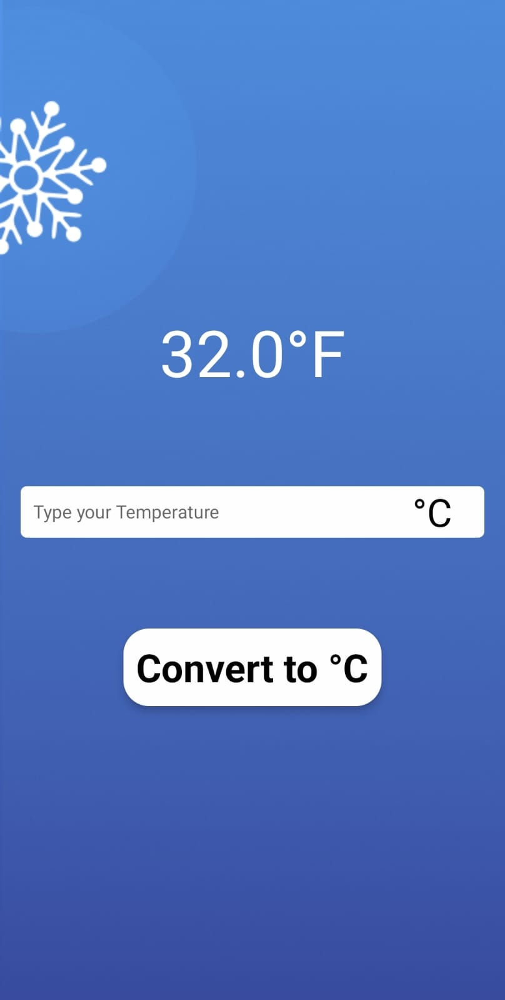
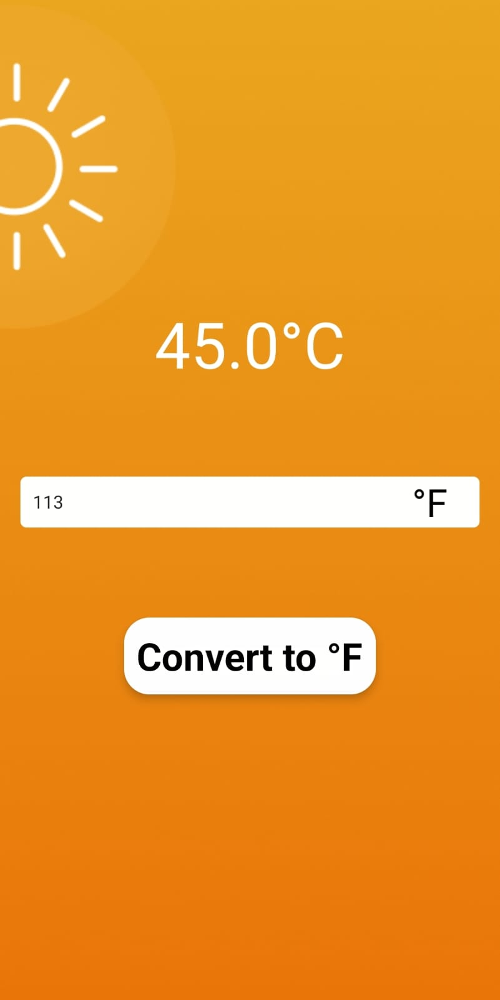
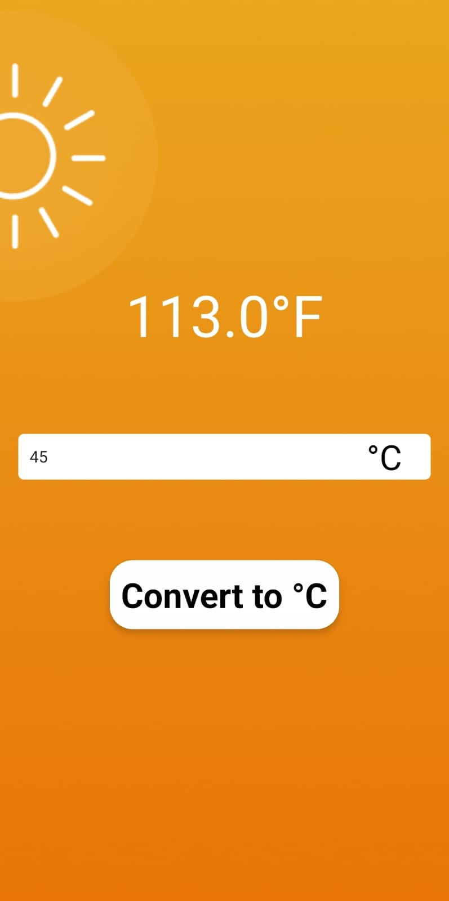

# Temperature Converter

This project is a simple Temperature Converter application that allows users to convert a given temperature from Celsius to Fahrenheit.

## Features
- User-friendly interface for input and output.
- Instant conversion of Celsius to Fahrenheit and Fahrenheit to Celcius .

## Usage
1. Enter the temperature value in Celsius and Fahrenheit.
2. Click on the "Convert" button (or the equivalent functionality in your implementation).
3. View the converted value in Fahrenheit.

## ScreenShots 

    
    
    

